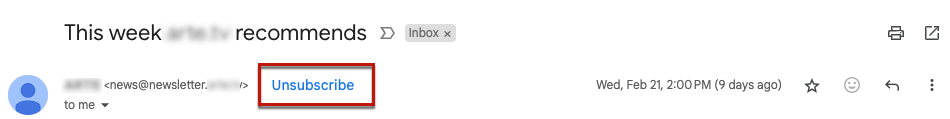
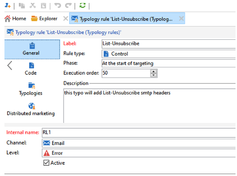

# Campaign Classic – Technische Empfehlungen {#technical-recommendations}

Nachfolgend sind verschiedene Verfahren, Konfigurationen und Tools aufgeführt, mit denen Sie Ihre Zustellbarkeitsrate bei Verwendung von Adobe Campaign Classic verbessern können.

## Konfiguration {#configuration}

### Reverse DNS {#reverse-dns}

: Adobe Campaign prüft, ob für eine IP-Adresse ein Reverse-DNS angegeben ist und ob dieses wirklich auf die IP-Adresse zurückverweist.

Bei der Netzwerkkonfiguration ist es wichtig sicherzustellen, dass für jede der für ausgehende Nachrichten bestimmten IP-Adressen ein korrektes Reverse-DNS angegeben ist. Für eine bestimmte IP-Adresse existiert also ein Reverse-DNS Datensatz (PTR-Datensatz) mit einem passenden DNS (Datensatz), das auf die ursprüngliche IP zurückverweist.

Die Wahl der Domain für ein Reverse DNS hat Auswirkungen auf den Umgang mit bestimmten ISPs. Insbesondere AOL akzeptiert nur Feedback-Schleifen mit einer Adresse in derselben Domain wie das Reverse DNS (siehe [Feedback Loop](#feedback-loop)).

>[!NOTE]
>
>Sie können [dieses externe Tool](https://mxtoolbox.com/SuperTool.aspx) verwenden, um die Konfiguration einer Domain zu überprüfen.

### MX-Regeln {#mx-rules}

MX-Regeln (Mail eXchanger) dienen zur Verwaltung der Kommunikation zwischen einem Sende- und einem Empfangs-Server.

Genauer gesagt werden sie verwendet, um die Geschwindigkeit zu steuern, mit der der Adobe Campaign MTA (Message Transfer Agent) E-Mails an jede einzelne E-Mail-Domain oder jeden einzelnen ISP sendet (z. B. hotmail.com, comcast.net). Diese Regeln basieren normalerweise auf von den ISPs veröffentlichten Beschränkungen (enthalten beispielsweise nicht mehr als 20 Nachrichten pro SMTP-Verbindung).

>[!NOTE]
>
>Weiterführende Informationen zur MX-Verwaltung in Adobe Campaign Classic finden Sie [diesem Abschnitt](https://experienceleague.adobe.com/docs/campaign-classic/using/installing-campaign-classic/additional-configurations/email-deliverability.html?lang=de#mx-configuration).

### TLS {#tls}

: TLS (Transport Layer Security) ist ein Verschlüsselungsprotokoll zur Sicherung der Verbindung zwischen zwei E-Mail-Servern. Damit wird sichergestellt, dass die E-Mail nur vom beabsichtigten Empfänger gelesen werden kann.

### Absender-Domain {#sender-domain}

Um die für den HELO-Befehl verwendete Domain zu definieren, bearbeiten Sie die Konfigurationsdatei der Instanz (conf/config-instance.xml) und definieren Sie ein Attribut „localDomain“ wie folgt:

```
<serverConf>
  <shared>
    <dnsConfig localDomain="mydomain.net"/>
  </shared>
</serverConf>
```

Die MAIL FROM-Domain ist die Domain, die in technischen Bounce-Nachrichten verwendet wird. Diese Adresse wird im Bereitstellungsassistenten oder über die Option NmsEmail_DefaultErrorAddr definiert.

### SPF-Eintrag {#dns-configuration}

Ein SPF-Eintrag kann derzeit auf einem DNS-Server als Eintrag vom Typ TXT (Code 16) oder als Eintrag vom Typ SPF (Code 99) definiert werden. Ein SPF-Eintrag hat die Form einer Zeichenfolge. z. B.:

```
v=spf1 ip4:12.34.56.78/32 ip4:12.34.56.79/32 ~all
```

definiert die beiden IP-Adressen 12.34.56.78 und 12.34.56.79 als zum Senden von E-Mails für die Domain autorisiert. **~all** bedeutet, dass jede andere Adresse als SoftFail interpretiert werden soll.

Recommendations zum Definieren eines SPF-Eintrags:

* Fügen Sie **~all** (SoftFail) oder **-all** (Fail) am Ende hinzu, um alle Server abzulehnen, die nicht definiert sind. Andernfalls können Server diese Domain fälschen (mit einer neutralen Auswertung).
* Fügen Sie nicht **ptr** hinzu (openspf.org empfiehlt dagegen, dies als kostspielig und unzuverlässig anzusehen).

>[!NOTE]
>
>Weitere Informationen zu SPF finden [ in diesem Abschnitt](/help/additional-resources/authentication.md#spf).

## Authentifizierung

>[!NOTE]
>
>Weitere Informationen zu den verschiedenen Formen der E-Mail-Authentifizierung finden [ in diesem Abschnitt](/help/additional-resources/authentication.md).

### DKIM {#dkim-acc}

>[!NOTE]
>
>Bei gehosteten oder hybriden Installationen erfolgt die DKIM-E-Mail-Authentifizierungssignatur für alle Nachrichten mit allen Domains durch den Enhanced MTA, wenn Sie auf den [Enhanced MTA](https://experienceleague.adobe.com/docs/campaign-classic/using/sending-messages/sending-emails/sending-an-email/sending-with-enhanced-mta.html?lang=de#sending-messages) aktualisiert haben.

Die Verwendung von [DKIM](/help/additional-resources/authentication.md#dkim) mit Adobe Campaign Classic setzt Folgendes voraus:

**Adobe Campaign-Optionsdeklaration**: In Adobe Campaign basiert der private DKIM-Schlüssel auf einem DKIM-Selektor und einer Domain. Es ist derzeit nicht möglich, mehrere private Schlüssel für dieselbe Domain/Subdomain mit unterschiedlichen Selektoren zu erstellen. Es ist nicht möglich, festzulegen, welche Selektor-Domain/Subdomain für die Authentifizierung weder in der Plattform noch in der E-Mail verwendet werden muss. Die Plattform wählt alternativ einen der privaten Schlüssel aus, was bedeutet, dass die Authentifizierung mit hoher Wahrscheinlichkeit fehlschlägt.

* Wenn Sie DomainKeys für Ihre Adobe Campaign-Instanz konfiguriert haben, müssen Sie nur **dkim** in den [Domain-Verwaltungsregeln](https://experienceleague.adobe.com/docs/campaign-classic/using/sending-messages/monitoring-deliveries/understanding-delivery-failures.html?lang=de#email-management-rules) auswählen. Falls nicht, führen Sie dieselben Konfigurationsschritte (privater/öffentlicher Schlüssel) durch wie für DomainKeys (die DKIM ersetzt haben).
* Es ist nicht notwendig, sowohl DomainKeys als auch DKIM für dieselbe Domain zu aktivieren, da es sich bei DKIM um eine verbesserte Version von DomainKeys handelt.
* Folgende Domains validieren aktuell DKIM: AOL, Gmail.

## Rückkopplungsschleife {#feedback-loop-acc}

Eine Feedback-Schleife funktioniert, indem auf der ISP-Ebene eine bestimmte E-Mail-Adresse für einen Bereich von IP-Adressen angegeben wird, der zum Senden von Nachrichten verwendet wird. Der ISP wird die Nachrichten, die von Empfängern als Spam gemeldet werden, auf ähnliche Weise an diesen Posteingang senden wie bei Bounce-Nachrichten. Die Plattform sollte so konfiguriert sein, dass zukünftige Sendungen für Benutzer, die sich beschwert haben, blockiert werden. Es ist wichtig, dass sie nicht mehr kontaktiert werden, auch wenn sie nicht den richtigen Ausschluss-Link verwendet haben. Aufgrund dieser Beschwerden fügt ein ISP seiner Blockierungsliste eine IP-Adresse hinzu. Je nach ISP wird eine Beschwerderate von etwa 1 % dazu führen, dass eine IP-Adresse blockiert wird.

Aktuell wird an der Konzeption eines Standards für das Format von Feedback-Loop-Nachrichten gearbeitet: das [Abuse Feedback Reporting Format (ARF)](https://tools.ietf.org/html/rfc6650).

Zur Implementierung eines Feedback Loops für eine Instanz sind folgende Elemente erforderlich:

* ein für die Instanz bestimmtes Postfach, bei dem es sich um das Bounce-Postfach handeln kann,
* für die Instanz bestimmte IP-Versandadressen.

Die Implementierung eines einfachen Feedback Loop in Adobe Campaign verwendet die Bounce-Nachrichtenfunktionalität. Das Feedback Loop-Postfach wird als ein Bounce-Postfach verwendet. Es wird eine Regel zur Erkennung dieser Nachrichten definiert. Die E-Mail-Adressen der Empfänger, die die Nachricht als Spam gemeldet haben, werden der Quarantäneliste hinzugefügt.

* Erstellen oder bearbeiten Sie im Knoten **[!UICONTROL Administration > Kampagnen > Unzustellbarkeitsverwaltung > E-Mail-Regeln]** eine Bounce-Message-Regel **Feedback_loop** und geben Sie dabei den Grund **Abgelehnt** sowie den Typ **Hard** an.
* Wenn speziell für das Feedback Loop ein Postfach definiert wurde, definieren Sie die dafür geltenden Zugriffsparameter, indem Sie unter **[!UICONTROL Administration > Plattform > Externe Konten]** ein neues externes Bounce-Message-Konto erstellen.

Der Mechanismus zur Verarbeitung von Beschwerdebenachrichtigungen ist sofort funktionstüchtig. Um die korrekte Funktionsweise der Regel sicherzustellen, können Sie die Konten zeitweise deaktivieren, damit sie diese Nachrichten nicht abrufen. Sie können die Inhalte des Feedback-Loop-Postfachs dann manuell überprüfen. Führen Sie auf dem Server die folgenden Befehle aus:

```
nlserver stop inMail@instance,
nlserver inMail -instance:instance -verbose.
```

Sollten Sie gezwungen sein, eine einzige Feedback-Loop-Adresse für mehrere Instanzen zu verwenden, müssen Sie:

* die empfangenen Nachrichten auf so vielen Postfächern replizieren wie Instanzen vorhanden sind,
* dafür sorgen, dass jedes Postfach von einer einzigen Instanz abgerufen wird,
* Konfigurieren Sie die Instanzen so, dass sie nur die Nachrichten verarbeiten, die sie betreffen: Die Instanzinformationen sind im Nachrichten-ID-Header der von Adobe Campaign gesendeten Nachrichten enthalten und befinden sich daher auch in den Feedback Loop-Nachrichten. Geben Sie einfach den Parameter **checkInstanceName** in der Konfigurationsdatei der Instanz an (standardmäßig wird die Instanz nicht überprüft, was dazu führen kann, dass bestimmte Adressen falsch unter Quarantäne gestellt werden):

  ```
  <serverConf>
    <inMail checkInstanceName="true"/>
  </serverConf>
  ```

Der Zustellbarkeitsdienst in Adobe Campaign sorgt für die Verwaltung Ihrer Anmeldung für Feedback-Loop-Dienste für die folgenden ISPs: AOL, BlueTie, Comcast, Cox, EarthLink, FastMail, Gmail, Hotmail, HostedEmail, Libero, Mail.ru, MailTrust, OpenSRS, QQ, RoadRunner, Synacor, Telenor, Terra, UnitedOnline, USA, XS4ALL, Yahoo, Yandex, Zoho.

## List-Unsubscribe {#list-unsubscribe}

Zur optimalen Verwaltung der Zustellbarkeit ist das Hinzufügen eines SMTP-Headers namens **List-Unsubscribe** zwingend erforderlich.

Diese Kopfzeile kann als Alternative zum Symbol „Als SPAM melden“ verwendet werden. Er wird als „Abmelden“-Link in den E-Mail-Schnittstellen der ISPs angezeigt.

Die Verwendung dieser Funktion senkt die Beschwerderate und trägt zum Schutz Ihrer Reputation bei. Feedback wird als Abmeldung ausgeführt.

Gmail, Outlook.com, Yahoo! und Microsoft Outlook unterstützen diese Methode. Ein „Abmelden“-Link ist direkt in ihrer Benutzeroberfläche verfügbar. z. B.:



>[!NOTE]
>
>Der Link „Abmelden“ wird möglicherweise nicht immer angezeigt. Tatsächlich kann dies von den jeweiligen Kriterien und der jeweiligen Politik jedes ISP abhängen. Stellen Sie daher sicher, dass Ihre Nachrichten von einem Absender gesendet werden:
>
>* Mit gutem Ruf
>* Unter der Spam-Beschwerdschwelle der ISPs
>* Vollständig authentifiziert

Es gibt zwei Versionen der Kopfzeilenfunktion „List-Unsubscribe“:

* **„mailto“ list-unsubscribe** - Bei dieser Methode wird durch Klicken auf den **Unsubscribe**-Link eine vorgefüllte E-Mail an die in der E-Mail-Kopfzeile angegebene Abmelde-Adresse gesendet. [Weitere Informationen](#mailto-list-unsubscribe)

* **„One-Click“ List-Unsubscribe** - Bei dieser Methode wird durch Klicken auf den **Unsubscribe**-Link der Benutzer direkt abgemeldet. [Weitere Informationen](#one-click-list-unsubscribe)

>[!NOTE]
>
>Ab dem 1. Juni 2024 verlangen große ISPs von Absendern, dass sie die **Liste mit einem Klick - Abmelden** einhalten.

### „mailto“ list-unsubscribe {#mailto-list-unsubscribe}

Bei dieser Methode wird durch Klicken auf den **Abmelden**-Link eine vorausgefüllte E-Mail an die in der E-Mail-Kopfzeile angegebene Abmelde-Adresse gesendet.

Um „mailto“ list-unsubscribe zu verwenden, müssen Sie eine Befehlszeile eingeben, in der Sie eine E-Mail-Adresse angeben, z. B.: `List-Unsubscribe: <mailto:client@newsletter.example.com?subject=unsubscribe?body=unsubscribe>`

>[!CAUTION]
>
>Das oben stehende Beispiel basiert auf der Empfängertabelle. Sollte die Datenbankimplementierung über eine andere Tabelle erfolgen, stellen Sie bitte sicher, dass Sie die Befehlszeile mit den korrekten Informationen umformulieren.

Sie können auch eine dynamische „mailto“-Liste erstellen, um sich über eine Befehlszeile abzumelden, z. B.: `List-Unsubscribe: <mailto:<%=errorAddress%>?subject=unsubscribe%=message.mimeMessageId%>`

Um **„mailto“ list-unsubscribe** in Campaign zu implementieren, haben Sie folgende Möglichkeiten:

* Direktes Hinzufügen der Befehlszeile in einem Versand oder einer Versandvorlage: [Weitere Informationen dazu](#adding-a-command-line-in-a-delivery-template)

* Erstellen einer Typologieregel - [Weitere Informationen](#creating-a-typology-rule)

#### Hinzufügen einer Befehlszeile zu einem Versand oder einer Vorlage {#adding-a-command-line-in-a-delivery-template}

Die Befehlszeile muss dem Abschnitt **[!UICONTROL Zusätzliche SMTP-Header]** des SMTP-Headers der E-Mail hinzugefügt werden.

Das kann entweder in jeder E-Mail oder in bereits existierenden Versandvorlagen erfolgen. Sie haben außerdem die Möglichkeit, eine neue diese Funktion beinhaltende Versandvorlage zu erstellen.

Geben Sie beispielsweise das folgende Skript in das Feld **[!UICONTROL Zusätzliche SMTP-]**&quot; ein: `List-Unsubscribe: mailto:unsubscribe@domain.com`. Wenn Sie auf den **Abmelden**-Link klicken, wird eine E-Mail an die Adresse unsubscribe@domain.com gesendet.

Sie können auch eine dynamische Adresse verwenden. Um beispielsweise eine E-Mail an die für die Plattform definierte Fehleradresse zu senden, können Sie das folgende Skript verwenden: `List-Unsubscribe: <mailto:<%=errorAddress%>?subject=unsubscribe%=message.mimeMessageId%>`


#### Erstellung einer Typologieregel {#creating-a-typology-rule}

Die Regel muss das Script zur Erzeugung der Befehlszeile beinhalten und im E-Mail-Header enthalten sein.

Wie Sie Typologieregeln in Adobe Campaign v7/v8 erstellen, erfahren Sie in [diesem Abschnitt](https://experienceleague.adobe.com/docs/campaign-classic/using/orchestrating-campaigns/campaign-optimization/about-campaign-typologies.html?lang=de#typology-rules).

>[!NOTE]
>
>Es wird empfohlen, eine Typologieregel zu erstellen: Die Funktion zum Abmelden von einer Liste wird automatisch in jeder E-Mail mit dieser Typologieregel hinzugefügt.

### Ein-Klick-Liste-Abmelden {#one-click-list-unsubscribe}

Bei dieser Methode wird durch Klicken auf den **Abmelden**-Link der Benutzer direkt abgemeldet, sodass nur eine einzige Aktion erforderlich ist, um das Abonnement zu kündigen.

Ab dem 1. Juni 2024 verlangen große ISPs von Absendern, dass sie die **Liste mit einem Klick - Abmelden** einhalten.

Zur Erfüllung dieser Anforderung muss der Absender:

* Fügen Sie die folgende Befehlszeile hinzu: `List-Unsubscribe-Post: List-Unsubscribe=One-Click`.
* Schließen Sie einen URI-Abmelde-Link ein.
* Unterstützt den Empfang der Antwort der HTTP-POST vom Empfänger, die von Adobe Campaign unterstützt wird. Sie können auch einen externen Service verwenden.

Um die Antwort auf die POST „Ein-Klick-Liste - Abo beenden“ direkt in Adobe Campaign v7/v8 zu unterstützen, müssen Sie der Web-Anwendung „Empfänger ohne Klick abmelden“ hinzufügen. Gehen Sie dazu wie folgt vor:

1. Navigieren Sie **[!UICONTROL Ressourcen]** > **[!UICONTROL Online]** > **[!UICONTROL Web-Anwendungen]**.

1. Laden Sie die Datei „Empfänger ohne Klick abmelden“ [XML](/help/assets/WebAppUnsubNoClick.xml.zip) hoch.

Zum Konfigurieren **Abmelde-Funktion mit einem Klick** in Campaign haben Sie folgende Möglichkeiten:

* Hinzufügen der Befehlszeile in einem Versand oder einer Versandvorlage: [Weitere Informationen dazu](#one-click-delivery-template)
* Erstellen einer Typologieregel - [Weitere Informationen](#one-click-typology-rule)

#### Konfigurieren von One-Click List-Unsubscribe im Versand oder in der Vorlage {#one-click-delivery-template}

Gehen Sie wie folgt vor, um die Abmeldeliste mit einem Klick in der Versand- oder Versandvorlage zu konfigurieren.

1. Navigieren Sie zum Abschnitt **[!UICONTROL SMTP]** der Versandeigenschaften.

1. Geben **[!UICONTROL unter „Zusätzliche SMTP]** Header“ die Befehlszeilen wie im folgenden Beispiel ein. Jede Kopfzeile sollte sich in einer separaten Zeile befinden.

z. B.:

```
List-Unsubscribe-Post: List-Unsubscribe=One-Click
List-Unsubscribe: <https://domain.com/webApp/unsubNoClick?id=<%= recipient.cryptedId %> >, < mailto:<%@ include option='NmsEmail_DefaultErrorAddr' %>?subject=unsubscribe<%=escape(message.mimeMessageId) %> >
```


Das obige Beispiel ermöglicht ISPs, die One-Click unterstützen, ein One-Click-Listen-Unsubscribe, während gleichzeitig sichergestellt wird, dass Empfänger, die nicht „mailto“ unterstützen, weiterhin das Unsubscribe per E-Mail anfordern können.

#### Erstellen einer Typologieregel zur Unterstützung von 1-Klick-Listen-Abmeldungen {#one-click-typology-rule}

Gehen Sie wie folgt vor, um die Abmeldung bei einer Klickliste mithilfe einer Typologieregel zu konfigurieren.

1. Navigieren Sie in der Navigationsstruktur zu **[!UICONTROL Typologieregeln]** und klicken Sie auf **[!UICONTROL Neu]**.

   


1. Konfigurieren Sie die neue Typologieregel wie folgt:

   * **[!UICONTROL Regeltyp]**: **[!UICONTROL Kontrolle]**
   * **[!UICONTROL Phase]**: **[!UICONTROL Zu Beginn der Zielgruppenbestimmung]**
   * **[!UICONTROL channel]**: **[!UICONTROL email]**
   * **[!UICONTROL Level]**: Ihre Wahl
   * **[!UICONTROL aktiv]**


   

1. Codieren Sie das JavaScript der Typologieregel wie im folgenden Beispiel gezeigt.

   >[!NOTE]
   >
   >Der unten beschriebene Code ist nur als Beispiel zu verwenden.

   In diesem Beispiel wird Folgendes beschrieben:
   * Konfigurieren einer „mailto“-Abmeldeliste. Er fügt die Kopfzeilen hinzu oder fügt die vorhandenen Parameter „mailto:“ an und ersetzt sie durch: &lt;mailto.>, https://…
   * Fügen Sie in der Kopfzeile Ein-Klick-Liste - Abmelden hinzu. Es verwendet `var headerUnsubUrl = "https://campmomentumv7-mkt-prod3.campaign.adobe.com/webApp/unsubNoClick?id=<%= recipient.cryptedId %>"÷`

   >[!NOTE]
   >
   >Sie können weitere Parameter hinzufügen (z. B. &amp;service =…).

   ```
   // Function to add or replace a header in the provided headers 
   function addHeader(headers, header, value)  { 
       
     // Create the new header line 
     var headerLine = header + ": " + value; 
       
     // Create a regular expression to find the specified header 
     var regExp = new RegExp(header + ":(.*)$", "i") 
       
     // Split the headers into individual lines 
     var headerLines = headers.split("\n"); 
       
     // Loop through each line 
     for (var i=0; i < headerLines.length; i++) { 
         
       // Check if the specified header exists 
       var match = headerLines[i].match(regExp) 
         
       // If it exists 
       if ( match != null ) { 
           
         // Replace the existing header line 
         headerLines[i] = headerLine; 
           
         // Return the modified headers 
         return headerLines.join("\n"); 
       } 
     } 
       
     // If the header does not exist, add the new header line 
     headerLines.push(headerLine); 
       
     // Return the modified headers 
     return headerLines.join("\n"); 
   } 
     
   // Function to get the value of a specified header from the provided headers 
   function getHeader(headers, header) { 
       
     // Create a regular expression to find the specified header 
     var regExp = new RegExp(header + ":(.*)$", "i") 
       
     // Split the headers into individual lines 
     var headerLines = headers.split("\n"); 
       
     // Loop each line 
     for each (line in headerLines) { 
         
       // Check if the specified header exists 
       var match = line.match(regExp); 
         
       // If it exists 
       if ( match != null ) { 
           
         // Return the header value, removing leading whitespace 
         return match[1].replace(/^\s*/, ""); 
       } 
     } 
       
     // If the header does not exist, return an empty string 
     return ""; 
   } 
     
     
   // Define the unsubscribe URL 
   var headerUnsubUrl = "https://campmomentumv7-mkt-prod3.campaign.adobe.com/webApp/unsubNoClick?id=<%= recipient.cryptedId %>"; 
     
   // Get the value of the List-Unsubscribe header 
   var headerUnsub = getHeader(delivery.mailParameters.headers, "List-Unsubscribe"); 
     
   // If the List-Unsubscribe header does not exist 
   if ( headerUnsub === "" ) { 
     // Add the List-Unsubscribe header 
     delivery.mailParameters.headers = addHeader(delivery.mailParameters.headers, "List-Unsubscribe", "<"+headerUnsubUrl+">"); 
   } 
   // If the List-Unsubscribe header exists and contains 'mailto' 
   else if(headerUnsub.search('mailto')){ 
     // Replace the existing List-Unsubscribe header 
     delivery.mailParameters.headers = addHeader(delivery.mailParameters.headers, "List-Unsubscribe", "<"+headerUnsubUrl+">"); 
   } 
     
   // Get the value of the List-Unsubscribe-Post header 
   var headerUnsubPost = getHeader(delivery.mailParameters.headers, "List-Unsubscribe-Post"); 
     
   // If the List-Unsubscribe-Post header does not exist 
   if ( headerUnsubPost === "" ) { 
     // Add the List-Unsubscribe-Post header 
     delivery.mailParameters.headers = addHeader(delivery.mailParameters.headers, "List-Unsubscribe-Post", "List-Unsubscribe=One-Click"); 
   } 
     
   // Return true to indicate success 
   return true; 
   ```


   

1. Fügen Sie Ihre neue Regel zu einer Typologie hinzu, die auf E-Mails angewendet wird.

   >[!NOTE]
   >
   >Sie können sie zur Standardtypologie hinzufügen.

   

1. Neuen Versand vorbereiten.

   >[!CAUTION]
   >
   >Stellen Sie sicher, dass **[!UICONTROL Feld „Zusätzliche SMTP]** Header“ in den Versandeigenschaften leer ist.

   

1. Überprüfen Sie während der Versandvorbereitung, ob Ihre neue Typologieregel angewendet wird.

   

1. Überprüfen Sie, ob der Abmelde-Link vorhanden ist.

   

## E-Mail-Optimierung {#email-optimization}

### SMTP {#smtp}

SMTP (Simple Mail Transfer Protocol) ist ein Internet-Standard für die E-Mail-Übertragung.

Die SMTP-Fehler, die nicht durch eine Regel überprüft werden, werden im Ordner **[!UICONTROL Administration]** > **[!UICONTROL Campaign Management]** > **[!UICONTROL Unzustellbarkeitsverwaltung]** > **[!UICONTROL Versandlogqualifizierung]** aufgelistet. Diese Fehlermeldungen werden standardmäßig als nicht erreichbare Softbounces interpretiert.

Die häufigsten Fehler müssen identifiziert und eine entsprechende Regel unter **[!UICONTROL Administration]** > **[!UICONTROL Campaign Management]** > **[!UICONTROL Unzustellbarkeitsverwaltung]** > **[!UICONTROL Mail-Regelsätze]** hinzugefügt werden, wenn Sie das Feedback der SMTP-Server korrekt qualifizieren möchten. Andernfalls führt die Plattform unnötige erneute Zustellversuche durch (im Falle unbekannter Benutzer) oder platziert bestimmte Empfänger nach einer bestimmten Anzahl von Tests falsch in Quarantäne.

### Dedizierte IPs {#dedicated-ips}

Adobe bietet jedem Kunden für die Anlaufphase eine dedizierte IP-Strategie zum Aufbau der Reputation und zur Optimierung der Zustellbarkeit.
