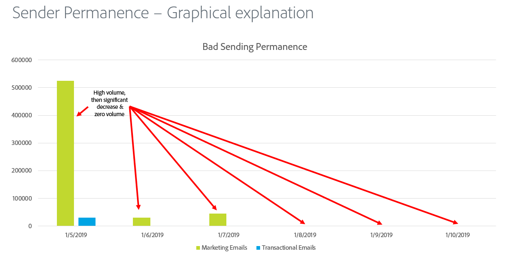
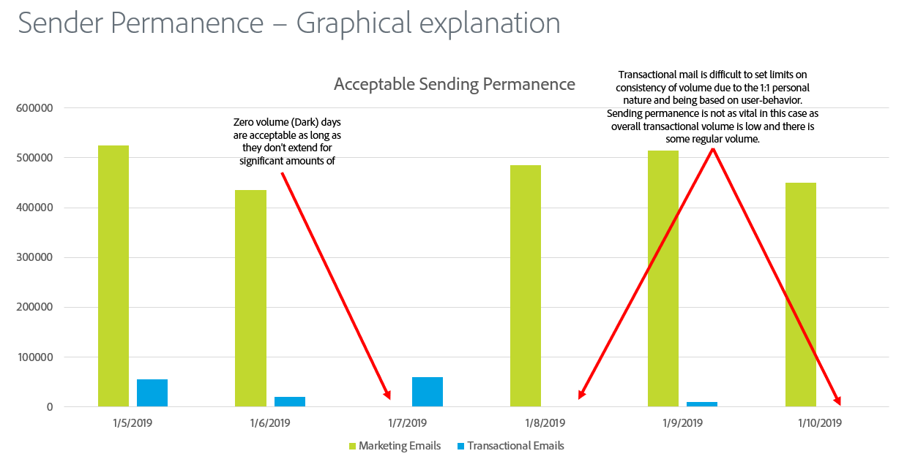

# Regelmäßiger Versand

Die Sendepersistenz ist der Prozess der Erstellung eines konsistenten Versandvolumens und einer konsistenten Versandstrategie, um die Reputation des ISPs zu wahren. Es gibt einige Gründe, warum die Dauerhaftigkeit des Absenders wichtig ist:

* Spammer verwenden in der Regel den „IP-Adressen-Hop“, d. h. sie verlagern den Traffic ständig über viele IP-Adressen, um Reputationsprobleme zu vermeiden.
* Konsistenz ist entscheidend, um den ISPs zu beweisen, dass der Absender seriös ist, und nicht zu versuchen, Reputationsprobleme zu umgehen, die das Ergebnis schlechter Versandpraktiken sind.
* Die Aufrechterhaltung dieser konsistenten Strategien über einen langen Zeitraum ist erforderlich, bevor einige ISPs den Absender überhaupt als seriös betrachten.

**Im Folgenden finden Sie einige Beispiele:**

