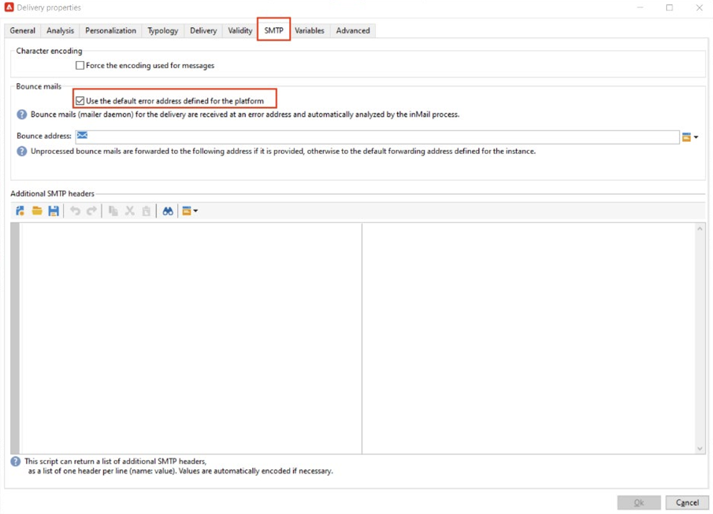

# Implementieren von [!DNL Domain-based Message Authentication, Reporting and Conformance] (DMARC)

In diesem Dokument erhalten Leser weitere Informationen zur E-Mail-Authentifizierungsmethode DMARC. Anhand einer Erläuterung der Funktionsweise von DMARC und der verschiedenen Richtlinienoptionen können Lesende die Auswirkungen von DMARC auf die E-Mail-Zustellbarkeit besser verstehen.

## Was ist DMARC? {#about}

Domain-based Message Authentication, Reporting and Conformance ist eine E-Mail-Authentifizierungsmethode, mit der Domain-Besitzer ihre Domain vor unbefugter Verwendung schützen können. DMARC bietet außerdem Feedback zum E-Mail-Authentifizierungsstatus und ermöglicht es Absenderinnen oder Absendern zu steuern, was mit E-Mails mit fehlgeschlagener Authentifizierung passiert. Dies umfasst Optionen, E-Mails zu überwachen, unter Quarantäne zu stellen oder abzulehnen, abhängig davon, welche DMARC-Richtlinie implementiert wurde.

DMARC verfügt über drei Richtlinienoptionen:

* **Überwachen (p=none):** Weist den Postfachanbieter/ISP an, alles zu tun, was er normalerweise mit der Nachricht tun würde.
* **Quarantäne (p=quarantine):** Weist den Postfachanbieter/ISP an, E-Mails zu versenden, die DMARC nicht an den Spam- oder Junk-Ordner des Empfängers weiterleiten.
* **Ablehnen (p=Ablehnen):** Weist den Postfachanbieter/ISP an, E-Mails zu blockieren, die DMARC nicht weiterleiten, was zu einem Bounce führt.

## Wie funktioniert DMARC? {#how}

SPF und DKIM werden verwendet, um eine E-Mail mit einer Domain zu verknüpfen und gemeinsam E-Mails zu authentifizieren. DMARC geht einen Schritt weiter und verhindert Spoofing, indem die von DKIM und SPF überprüfte Domain abgeglichen wird. Um DMARC zu durchlaufen, muss eine Nachricht SPF oder DKIM durchlaufen. Wenn diese beide Authentifizierungen fehlschlagen, schlägt DMARC fehl und die E-Mail wird gemäß Ihrer ausgewählten DMARC-Richtlinie zugestellt.

>[!NOTE]
>
>DMARC erfordert eine Abstimmung zwischen der Absenderadresse und der Rücksenderadresse.

## Warum sollte DMARC implementiert werden? {#why}

DMARC ist optional und ist zwar nicht erforderlich, aber es ist kostenlos und ermöglicht E-Mail-Empfängern die einfache Identifizierung der Authentifizierung von E-Mails, was den Versand potenziell verbessern könnte. Einer der Hauptvorteile von DMARC ist das Reporting zu Fehlern bei SPF und/oder DKIM. Außerdem erhalten die Absender ein gewisses Maß an Kontrolle darüber, was mit E-Mails passiert, die keine dieser Authentifizierungsmethoden durchlaufen. Durch DMARC-Berichte erhalten Absender Einblicke in die Nachrichten, die DMARC nicht unterstützen, sodass Schritte zur Abmilderung weiterer Fehler unternommen werden können.

>[!NOTE]
>
>Wenn Sie BIMI implementieren möchten, ist eine p=Quarantäne oder p=DMARC-Richtlinie ablehnen erforderlich.

## Best Practices für die Implementierung von DMARC {#best-practice}

Da DMARC optional ist, wird es auf keiner ESP-Plattform standardmäßig konfiguriert. Ein DMARC-Eintrag muss im DNS für Ihre Domain erstellt werden, damit er funktioniert. Darüber hinaus ist eine E-Mail-Adresse Ihrer Wahl erforderlich, um anzugeben, wohin DMARC-Berichte innerhalb Ihres Unternehmens gehen sollen. Als Best Practice gilt Folgendes
Es wird empfohlen, das Rollout der DMARC-Implementierung langsam durchzuführen, indem Sie Ihre DMARC-Richtlinie von P=None auf P=Quarantäne und dann auf P=Ablehnen eskalieren, um in DMARC Erkenntnisse über die potenziellen Auswirkungen von DMARC zu gewinnen.

1. Analysieren Sie das Feedback, das Sie erhalten und verwenden (p=none), das den Empfänger anweist, keine Aktionen gegen Nachrichten durchzuführen, die bei der Authentifizierung fehlschlagen, aber dennoch E-Mail-Berichte an den Absender senden. Überprüfen und beheben Sie außerdem Probleme mit SPF/DKIM, wenn die Authentifizierung für legitime Nachrichten fehlschlägt.
1. Prüfen Sie, ob SPF und DKIM aufeinander abgestimmt sind und die Authentifizierung für alle legitimen E-Mails weitergeben. Verschieben Sie dann die Richtlinie in („p=Quarantäne„), wodurch der empfangende E-Mail-Server E-Mails unter Quarantäne stellt, bei denen die Authentifizierung fehlschlägt (dies bedeutet im Allgemeinen, dass diese Nachrichten in den Spam-Ordner verschoben werden).
1. Passen Sie die Richtlinie an (p=Ablehnen). Die Richtlinie p = Ablehnen weist den Empfangs-Server an, jede E-Mail für die Domain, bei der die Authentifizierung fehlschlägt, komplett zu verweigern (Bounce). Wenn diese Richtlinie aktiviert ist, haben nur E-Mails, die zu 100 % von Ihrer Domain authentifiziert wurden, überhaupt die Möglichkeit, im Posteingang platziert zu werden.

   >[!NOTE]
   >
   >Verwenden Sie diese Richtlinie mit Vorsicht und ermitteln Sie, ob sie für Ihr Unternehmen geeignet ist.

## DMARC-Berichte {#reporting}

DMARC bietet die Möglichkeit, Berichte zu E-Mails zu erhalten, bei denen SPF/DKIM fehlschlägt. Es gibt zwei verschiedene Berichte, die von ISP-Services im Rahmen des Authentifizierungsprozesses generiert werden, den Absender über die RUA/RUF-Tags in ihrer DMARC-Richtlinie erhalten können:

* **Aggregierte Berichte (RUA):** enthält keine personenbezogenen Daten (Personally Identifiable Information), die DSGVO-sensibel wären.
* **Forensische Berichte (RUF):** Enthält E-Mail-Adressen, die DSGVO-sensibel sind. Vor der Nutzung von sollten Sie intern überprüfen, wie Sie mit Informationen umgehen, die die DSGVO einhalten müssen.

Diese Berichte dienen hauptsächlich dazu, einen Überblick über E-Mails zu erhalten, bei denen ein Spoofing-Versuch unternommen wird. Hierbei handelt es sich um hochtechnische Berichte, die am besten über ein Tool eines Drittanbieters verdaut werden können. Einige Unternehmen, die auf die Überwachung von DMARC spezialisiert sind:

* [ValiMail](https://www.valimail.com/products/#automated-delivery)
* [Agari](https://www.agari.com/)
* [DMARKISCH](https://dmarcian.com/)
* [Proofpoint](https://www.proofpoint.com/us)

>[!CAUTION]
>
>Wenn sich die E-Mail-Adressen, die Sie zum Empfang von Berichten hinzufügen, außerhalb der Domain befinden, für die der DMARC-Eintrag erstellt wird, müssen Sie deren externe Domain autorisieren, dem DNS mitzuteilen, dass Sie diese Domain besitzen. Folgen Sie dazu den Schritten aus der [dmarc.org-Dokumentation](https://dmarc.org/2015/08/receiving-dmarc-reports-outside-your-domain)

### Beispiel für einen DMARC-Eintrag {#example}

```
v=DMARC1; p=reject; fo=1; rua=mailto:dmarc_rua@emaildefense.proofpoint.com;ruf=mailto:dmarc_ruf@emaildefense.proofpoint.co
```

## DMARC Tags und ihre Funktionen {#tags}

DMARC-Datensätze enthalten mehrere Komponenten, die als DMARC-Tags bezeichnet werden. Jedes Tag hat einen -Wert, der einen bestimmten Aspekt von DMARC angibt.

| Tag-Name | Erforderlich/Optional | Funktion | Beispiel | Standardwert |
|  ---  |  ---  |  ---  |  ---  |  ---  |
| v | Erforderlich | Dieses DMARC-Tag gibt die Version an. Es gibt derzeit nur eine Version, daher hat diese einen festen Wert von v=DMARC1 | v=DMARC1 DMARC1 | DMARC1 |
| p | Erforderlich | Zeigt die ausgewählte DMARC-Richtlinie an und leitet den Empfänger an, E-Mails zu melden, unter Quarantäne zu stellen oder abzulehnen, wenn die Authentifizierungsprüfungen fehlschlagen. | p=Keine, Quarantäne oder Zurückweisung | – |
| fo | Optional | Ermöglicht dem Domain-Inhaber das Festlegen von Berichtsoptionen. | 0: Bericht generieren, wenn alles fehlschlägt<br/>1: Bericht generieren, wenn alles fehlschlägt<br/>d: Bericht generieren, wenn DKIM fehlschlägt<br/>s: Bericht generieren, wenn SPF fehlschlägt | 1 (empfohlen für DMARC-Berichte) |
| PCT | Optional | Gibt den Prozentsatz der Nachrichten an, die gefiltert werden sollen. | PCT=20 | 100 |
| Rua | Optional (empfohlen) | Gibt an, wo aggregierte Berichte bereitgestellt werden. | `rua=mailto:aggrep@example.com` | – |
| Ruf | Optional (empfohlen) | Gibt an, wo forensische Berichte bereitgestellt werden. | `ruf=mailto:authfail@example.com` | – |
| SP | Optional | Gibt eine DMARC-Richtlinie für Subdomains der übergeordneten Domain an. | SP=Zurückweisung | – |
| Adkim | Optional | Kann entweder Streng (s) oder Relaxed (r) sein. Eine entspannte Ausrichtung bedeutet, dass die in der DKIM-Signatur verwendete Domain eine Subdomain der „Von“-Adresse sein kann. Strenge Ausrichtung bedeutet, dass die in der DKIM-Signatur verwendete Domain genau mit der in der Absenderadresse verwendeten Domain übereinstimmen muss. | adkim=r | r |
| ASPF | Optional | Kann entweder Streng (s) oder Relaxed (r) sein. Eine entspannte Ausrichtung bedeutet, dass die Domain „ReturnPath“ eine Subdomain der Absenderadresse sein kann. Strenge Ausrichtung bedeutet, dass die Domain des Rücksendepfads exakt mit der Absenderadresse übereinstimmen muss. | aspf=r | r |

## DMARC und Adobe Campaign {#campaign}

>[!NOTE]
>
>Wenn Ihre Campaign-Instanz auf AWS gehostet wird, können Sie DMARC über das Control Panel für Ihre Subdomains implementieren. [Erfahren Sie, wie Sie DMARC-Datensätze mithilfe des Control Panels implementieren](https://experienceleague.adobe.com/docs/control-panel/using/subdomains-and-certificates/txt-records/dmarc.html?lang=de).

Ein häufiger Grund für DMARC-Fehler ist eine falsche Ausrichtung zwischen der „Von“- und der „Fehler-an“- oder der „Rückpfad“-Adresse. Um dies zu vermeiden, sollten Sie beim Einrichten von DMARC Ihre „Von“- und „Fehler-an“-Adresseinstellungen in Ihren Versandvorlagen überprüfen.

1. Überprüfen Sie in Ihrer Versandvorlage, welche Adresse derzeit als Absenderadresse festgelegt ist.

   

1. Wählen Sie hier „Eigenschaften“ aus, mit denen Sie Ihre Versandvorlage weiter bearbeiten können. Wählen Sie in diesem Fenster SMTP aus und deaktivieren Sie ggf. „Standardmäßige Fehleradresse der Plattform verwenden“. Versandvorlagen in Adobe Campaign Aktivieren Sie dieses Kontrollkästchen standardmäßig. Die Standardfehleradresse ist möglicherweise nicht die Adresse, die der Absenderadresse in dieser Versandvorlage zugeordnet ist.

   

1. Wenn dieses Kontrollkästchen deaktiviert ist, wird ein Textfeld angezeigt, in das Sie eine eindeutige Fehleradresse eingeben können, die dieselbe Domain wie in der Absenderadresse verwendet.

   

Sobald diese Änderungen gespeichert wurden, können Sie mit Ihrer DMARC-Implementierung mit der richtigen Domain-Ausrichtung fortfahren.

## Nützliche Links {#links}

* [DMARC.org](https://dmarc.org/){target="_blank"}
* [m3AAWG E-Mail-Authentifizierung](https://www.m3aawg.org/sites/default/files/document/M3AAWG_Email_Authentication_Update-2015.pdf){target="_blank"}
