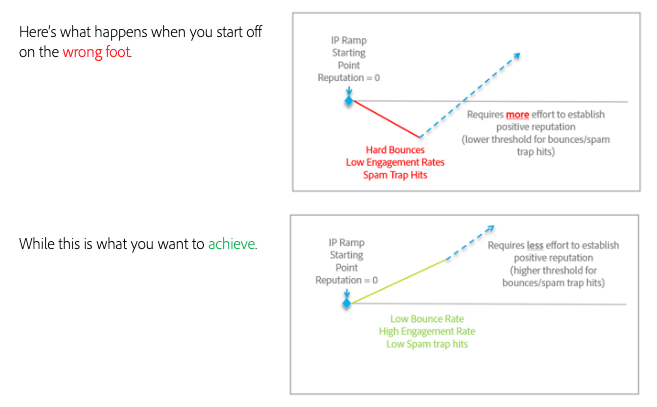

# Reibungsloser Wechsel zwischen E-Mail-Plattformen

Beim Verschieben von E-Mail-Dienstanbietern (ESPs) ist es nicht möglich, auch Ihre bestehenden, etablierten IP-Adressen zu übertragen. Es ist wichtig, dass Sie Best Practices befolgen, um eine positive Reputation zu entwickeln, wenn Sie von Neuem beginnen. Da die neuen IP-Adressen, die Sie verwenden werden, noch nicht bekannt sind, können die ISPs den von ihnen kommenden E-Mails nicht vollständig vertrauen und müssen bei dem, was sie für die Zustellung an ihre Kunden zulassen, vorsichtig sein.

Einen positiven Ruf aufzubauen, ist ein Prozess. Aber sobald es etabliert ist, haben kleine negative Indikatoren weniger Auswirkungen auf Sie und Ihren E-Mail-Versand.

Die Zeit zum Aufwärmen Ihrer IP-Adressen und Domains kann variieren, aber bis zu einer achtwöchigen Benchmark ist bei typischen Absendern üblich, um eine Reputation bei den meisten Tier-1-ISPs (Gmail, Microsoft, Verizon/Yahoo/AOL usw.) aufzubauen.

In den nächsten Abschnitten werden wir einige Schlüsselbereiche untersuchen, auf die wir uns konzentrieren müssen, um ordnungsgemäß zu integrieren:

1. [Infrastruktur](/help/transition-process/infrastructure.md)
2. [Kriterien für die Zielgruppenbestimmung](/help/transition-process/targeting-criteria.md)
3. [ISP-spezifische Überlegungen beim IP-Warming](/help/transition-process/isp-specific-considerations-during-ip-warming.md)
4. [Volumen](/help/transition-process/volume.md)
