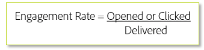

# Kriterien für die Zielgruppenbestimmung

Wenn Sie neuen Traffic versenden, sollten Sie in den frühen Phasen des IP-Warming-Vorgangs nur die aktivsten Benutzer ansprechen. Auf diese Weise können Sie von Anfang an eine positive Reputation aufbauen, um effektiv Vertrauen aufzubauen, bevor Sie Ihre weniger interaktiven Zielgruppen einbinden. Hier ist eine einfache Formel für die Interaktion:

In der Regel basiert eine Interaktionsrate auf einem bestimmten Zeitraum. Diese Metrik kann stark variieren, je nachdem, ob die Formel auf einer allgemeinen Ebene oder für bestimmte Mailing-Typen oder Kampagnen angewendet wird. Die spezifischen Targeting-Kriterien müssen in Zusammenarbeit mit Ihrem Adobe Zustellbarkeitsberater angegeben werden, da jeder Absender und ISP variiert und normalerweise einen benutzerdefinierten Plan erfordert.

## Produktspezifische Ressourcen

**Analytics**

* [Wie Sie die Interaktions- und Kundenbindungsraten steigern können (Tutorial)](https://experienceleague.adobe.com/docs/analytics-learn/tutorials/mobile-app-analytics/measuring-mobile-analytics/how-to-increase-engagement-and-retention-rates.html?lang=en#mobile-app-analytics): *Identifizieren Sie interaktive Zielgruppen anhand ihres Verhaltens mithilfe von Kohorten und lernen Sie die zugrunde liegenden Ursachen kennen, die zu einer Verklebung in Ihren Mobile Apps führen. Verwenden Sie Datenwissenschaftsalgorithmen in Segment IQ, um die Unterschiede und Ähnlichkeiten zwischen Segmenten zu kennen.*

**Campaign Standard**

* [KI-gestützte E-Mails: Bewertung prädiktiver Interaktionen](https://experienceleague.adobe.com/docs/campaign-standard/using/testing-and-sending/preparing-and-testing-messages/predictive.html#predictive-scoring)
